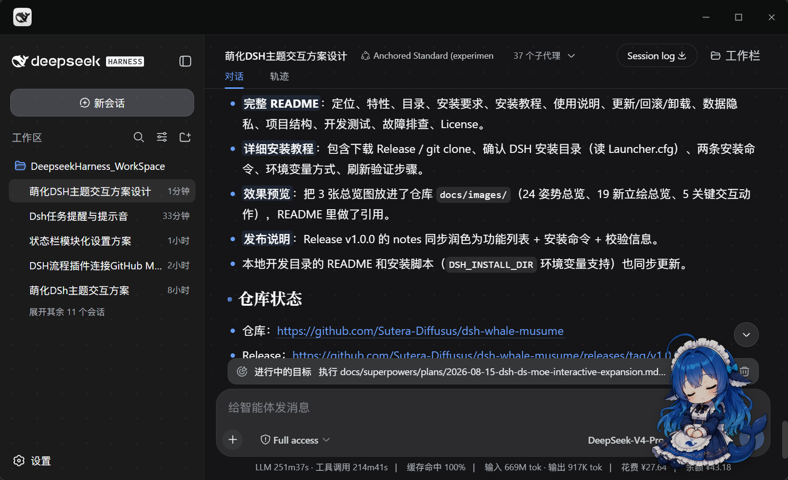
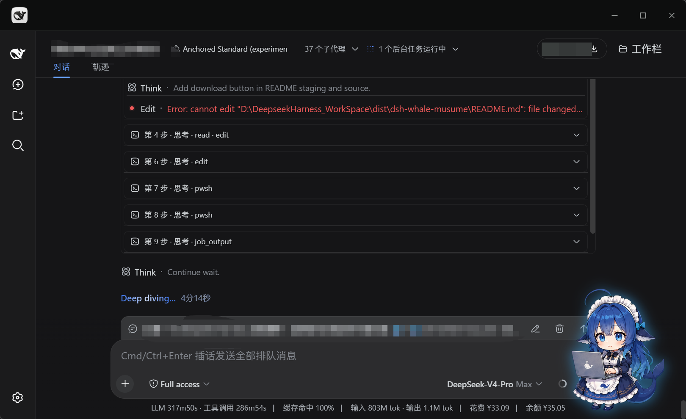
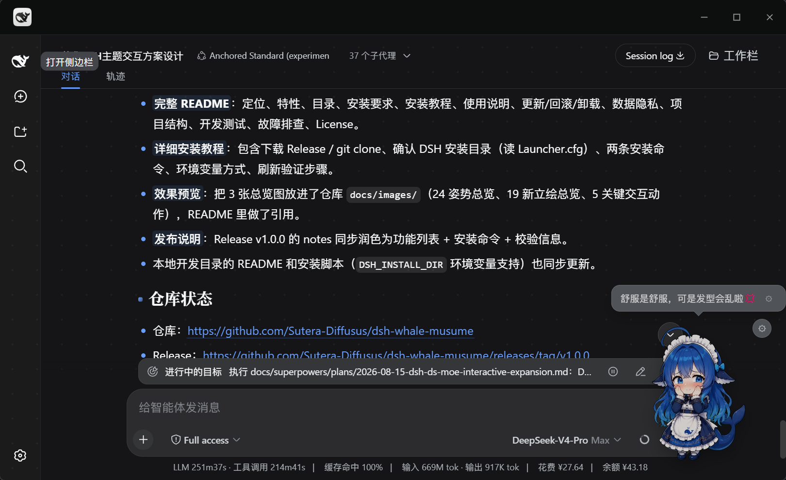
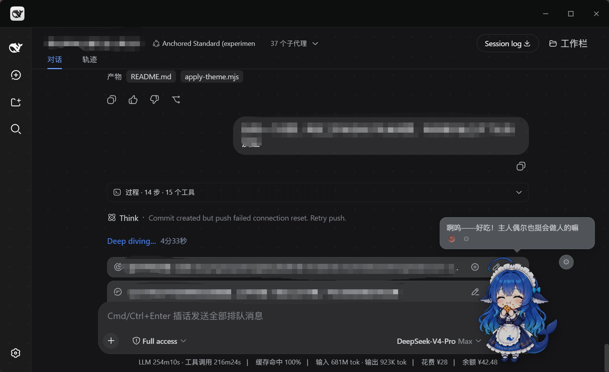
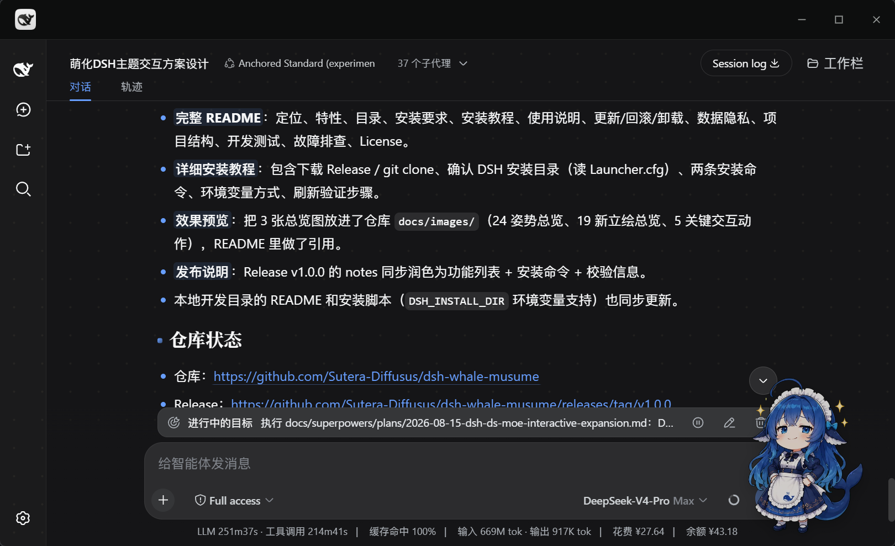
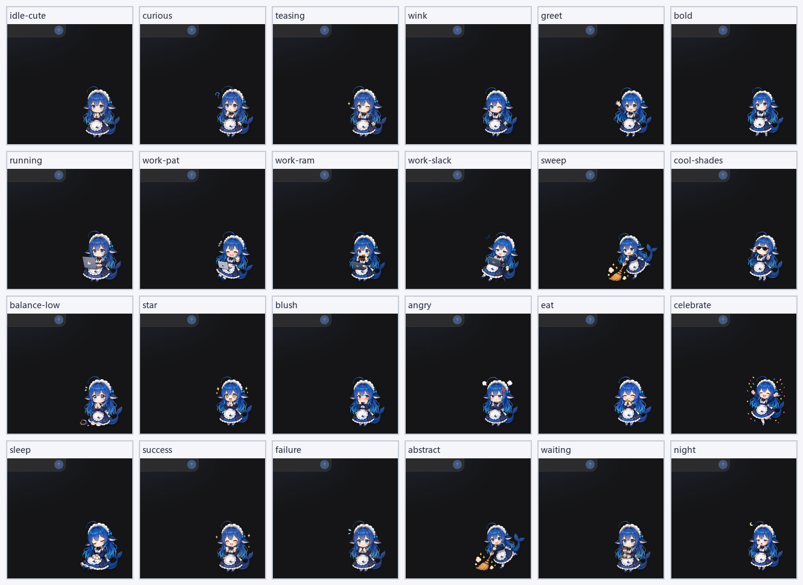

<div align="center">


# 鲸鱼娘 · dsh-whale-musume

**DeepSeek Harness 的桌宠看板娘：安静陪你写代码，工作一开始她就抱起笔记本，绝不插嘴。**

<a href="CHANGELOG.md"></a>
<a href=".github/workflows/test.yml"></a>
<a href="LICENSE"></a>
<a href="#兼容性"></a>
<a href="#兼容性"></a>
<a href="#兼容性"></a>
[](https://dshbase.com/zh/plugins/dsh-whale-musume/)
<a href="https://github.com/Sutera-Diffusus/dsh-whale-musume/releases"></a>
<a href="https://github.com/Sutera-Diffusus/dsh-whale-musume/discussions"></a>

[**一分钟上手**](#一分钟上手) · [看看她长什么样](#看看她长什么样) · [她有什么](#她有什么) · [常见问题](#常见问题) · [English](README.en.md)



</div>

---

## 为什么是鲸鱼娘

大部分桌宠要么只是「会动的图」，要么会在你专注时抢注意力。鲸鱼娘的三条硬规则：

| 原则 | 具体做法 |
|---|---|
| **不打断你** | 工作态（有工具在跑）**绝不弹话、不乱切姿势**；所有闲聊、关怀、播报都只在待机时发生 |
| **不抢你的焦点** | 默认是纯装饰：`aria-hidden`、不拦截键盘、不覆盖业务 DOM、不改任何内置包文件；连焦点都要你主动开无障碍模式才拿得到 |
| **不给你添隐私负担** | 无遥测、不上传、默认零外部请求；台词播报、关键词感知、余额、无障碍这些会读内容/金额的功能**全部默认关闭** |

而且她是**真的会看你在干什么**：不是定时随机换图，而是读取宿主的结构化标记（工具卡状态、会话运行标记、终端块）来判断你在忙什么，再决定摆哪个姿势、要不要闭嘴。

---

## 目录

- [一分钟上手](#一分钟上手)
- [看看她长什么样](#看看她长什么样)
- [她有什么](#她有什么)
- [兼容性](#兼容性)
- [第一次使用](#第一次使用)
- [使用说明](#使用说明)
- [设置面板](#设置面板)
- [更新 / 回滚 / 卸载](#更新--回滚--卸载)
- [版本更新](#版本更新)
- [数据与隐私](#数据与隐私)
- [常见问题](#常见问题)
- [故障排查](#故障排查)
- [路线图](#路线图)
- [项目结构](#项目结构)
- [开发与测试](#开发与测试)
- [参与贡献](#参与贡献)
- [致谢](#致谢)
- [License](#license)

---

## 一分钟上手

```powershell
# 桌面端（Electron 壳）——把路径换成你的安装位置
$Desktop = "D:\DeepseekHarnessDesktop"
$Cli = "$Desktop\resources\app.asar\dsh\node_modules\@deepseek-ai\dsh-desktop-host\lib\cli.js"
$env:ELECTRON_RUN_AS_NODE = "1"
& "$Desktop\DeepSeek Harness.exe" --expose-internals $Cli plugin --profile desktop add github:Sutera-Diffusus/dsh-whale-musume
```

```powershell
# 旧版 Web profile
dsh plugin --profile web add github:Sutera-Diffusus/dsh-whale-musume
```

装完**重启宿主**（桌面端重启应用；旧版 Web 重启 `dsh web` 后 `Ctrl+F5`），她就出现在右下角了。

<details>
<summary>装完怎么确认她真的进来了？</summary>

在宿主页面按 `F12` 打开控制台，执行：

```js
window.__dshWhaleMusumeBooted                                  // true
document.querySelectorAll('[data-dsh-whale-root]').length      // 1
getComputedStyle(document.querySelector('[data-dsh-whale-root]')).display  // "block"（首页可见）
window.__dshWhaleMoeDebug                                      // state 非 "hidden"，含当前姿势/视图等信息
```

四项都对说明安装成功。任一项不对，见[故障排查](#故障排查)。

</details>

> 另有一种**脚本安装**（注入前端资源 + 自带备份回滚），只适合主题集成或没有组合包支持的旧环境：见 [`scripts/apply-theme.mjs`](scripts/apply-theme.mjs)。两种方式**二选一，不要混用**。

---

## 看看她长什么样

<div align="center">

| 待机陪伴 | 工作状态联动 |
|---|---|
|  |  |
| 默认悬浮在右下角，随机喝咖啡、伸懒腰 | 检测到工具运行，抱起笔记本，带淡蓝光晕 |

| 摸头互动 | 投喂互动 |
|---|---|
|  |  |
| 单击摸头，脸红立绘 + 爱心星星飞出 | 右键投喂，提升饱食度与好感度 |

| 悬浮形态（可拖拽） | 立绘总览（90+ 张） |
|---|---|
|  |  |
| 200px 默认尺寸，拖到她喜欢的地方 | 状态 / 互动 / 成长 / 游戏 / 天气 / 节日 / 梗表情 |

</div>

更多素材：[交互动作总览](docs/images/actions-board.png) · [新增立绘总览](docs/images/new-poses-board.png) · [宣传海报 v1](docs/images/promo-poster-v1.png) / [v2](docs/images/promo-poster-v2.png) / [v3](docs/images/promo-poster-v3.png) / [v4](docs/images/promo-poster-v4.png)

---

## 她有什么

### 🐋 本体与行为

| 特性 | 说明 |
|---|---|
| 悬浮 / 侧栏 / 底栏 / 迷你 / 自动 | 五种形态，按视图自动切换；默认 200px 悬浮 |
| 拖拽 + 惯性 | 拖拽时切换「被拎起来」立绘，身体随光标方向摇摆；松手后按瞬时速度滑行一段并旋转回正，撞到屏幕边缘会「抓住」边缘停住；轻放只做一次轻微回弹，位置在滑行结束后才保存 |
| 动势遮断过渡 | 待机 ↔ 工作之间用「下压 → 换图 → 弹起」过渡，不叠影、不闪黑；后台标签页被浏览器暂停换图动画时有 1.6s 超时兜底 |
| 唤回入口 | 在设置里关掉她之后，左下角留一枚 🐋 按钮，点一下就叫回来，不会再「消失得找不着」 |

### 💼 工作状态联动

| 特性 | 说明 |
|---|---|
| 忙闲联动 | 检测到工具运行自动切「抱笔记本工作」，带淡蓝光晕与「工作中」标签 |
| 按工具类型细分姿态 | 跑命令 / 改文件 / 搜索 / 测试 / 评审 / 部署 / 调试各有对应姿势；识别不了就回落通用姿态，绝不乱猜 |
| 工作期稳定 | 工作中不切小剧场、不插话；信号短暂中断时姿势继续钉住（工作台 8s / 其他页 4s），不抽搐 |
| 点击反应 | 工作中点她会随机出现「害羞抱电脑」或「偷吃内存条」，不打断工作状态 |

### 📈 养成与成就

- **基础数值**：心情、好感度、饱食度、等级、连续签到、陪伴时长
- **每日任务**：3 个槽位每日自动刷新，完成领好感奖励
- **周签到**：本周 7 格签到板，集满 1 / 3 / 7 天有里程碑奖励
- **羁绊等级**：Lv3 解锁新待机动作、Lv5 称号「鲸汐守护者」、Lv7 隐藏彩蛋
- **39 个成就 + 成就墙**：互动类 / 陪伴类 / DSH 用量类 / 游戏类 / 任务类，已解锁高亮、未解锁灰显
- **成长日记**：按时间记录羁绊升级、成就解锁等节点，倒序显示最近 12 条

### 💬 台词与陪伴

- **530+ 条台词**：全场景覆盖，可爱为主，叠加打工人 / 摸鱼 / DDL / 画饼 / 发疯文学等安全梗
- **梗关键词表情**：命中 13 个关键词（kyun、OMG、doge、sike、膜拜、peace、怀疑人生、waku waku 等）现场变身表情包
- **5–8 分钟主动闲聊**：按当前任务内容本地分类贴题，工作态绝不插嘴；深夜 23:00–5:59 不主动打扰
- **心情分层**：心情低落时温柔、高涨时元气；羁绊等级解锁专属台词
- **天气陪伴**：城市留空即零联网；填写后走 Open-Meteo（免费无需 Key），附带雨 / 雪 / 雷闪 / 风 / 雾 / 热浪 / 霜雾等全屏氛围特效，工作态自动降档
- **主动关怀**：久坐提醒（连续忙 25 分钟）／深夜劝休息／卡住陪伴（状态停滞 8 分钟）／回来打招呼（离开超 3 分钟），两次之间至少隔 15 分钟
- **可选台词播报**：检测到宿主装有 `dsh-xiaomi-tts` 服务时才会出现「台词播报」开关，**默认关闭**；未安装、未配置或播放失败都不影响原有交互

### 🎀 互动与视觉

- **分区点击**：头 / 肚子 / 尾巴三区独立判定，各有专属立绘、特效与台词
- **点击特效**：爱心 / 星星 emoji 飞出；三连击触发星星眼庆祝 + 粒子特效 + 旋转动画
- **90+ 张立绘**：待机、工作中、思考、离开、成长四态、游戏四态、天气三态、节日五套（圣诞 / 万圣 / 中秋 / 春节 / 情人节，当天自动换装）
- **小游戏「戳泡泡·泡泡派对」**：4×4 网格，普通 / 星星 / 炸弹三种泡泡，连击加分，30 秒一局三档结算；鼠标 + 键盘双通道可达；每日 3 局养成上限防刷

### 🧩 工程特性

- **零侵入**：纯前端注入 + 一个只读静态资源路由，不改任何内置包文件
- **无构建步骤**：仓库里的 `assets/` 就是运行产物，装入即用
- **立绘预加载**：首屏只预载 5 张常用姿势，其余 90+ 张在空闲时段每 120ms 取一张，冷启动切姿势不迟滞；预取失败完全静默
- **无障碍模式**（默认关闭）：可 Tab 聚焦、Enter / 空格摸头、方向键微调位置（Shift 加速），状态变化经 `aria-live` 播报
- **主题跟随**：跟随宿主明暗主题，只影响气泡/菜单这类 UI，**立绘不做滤镜**，不改画风
- **可测试性**：核心状态机与表现层分离，142 项单元测试可直接 `node --test` 跑

---

## 兼容性

| 宿主 | 支持 | 说明 |
|---|:---:|---|
| **DeepSeek Harness 桌面端**（Electron 壳，内嵌 DSH `0.2.0-rc.2`） | ✅ 已实测 | GUI 端口默认 `127.0.0.1:19387`；装完需重启桌面端。安装/回滚步骤见[桌面端部署手册](docs/desktop-0.2.0-rc.2-deploy.md) |
| **旧版 Web profile**（DSH `0.1.x`） | ✅ 已实测 | `0.1.0-rc.6` 及以上；设置面板在 `0.1.1-rc.2` 实测 |
| 其他 profile（headless / acp 等） | ➖ 无界面 | 没有浏览器界面，桌宠无处显示 |

| 项目 | 要求 |
|---|---|
| 操作系统 | Windows 10 / 11（当前桌面端的支持范围） |
| Node.js | 18+（仅脚本安装方式需要；组合包安装不需要） |
| 浏览器 | Edge / Chrome 最新版 |

> **数据不互通**：桌面端主窗口 origin 是 `dsh-app://app`，旧版 Web 是 `http://127.0.0.1:<端口>`，两边 `localStorage`（`whale-moe:*`）互不相通，也不会自动迁移。详见[数据与隐私](#数据与隐私)。

<details>
<summary>桌面端适配了哪些契约差异？（给插件作者看的）</summary>

v2.2.0 适配桌面端时，逐条核对了 DSH `0.2.0-rc.2` 的真实契约并写了证据文档（[`docs/desktop-0.2.0-rc.2-contract.md`](docs/desktop-0.2.0-rc.2-contract.md)）：

| 契约点 | 0.2.0-rc.2 的变化 | 我们的处理 |
|---|---|---|
| 工具卡标记 | `[data-role="tool"]` 等旧标记 0 命中 | 改用 `[data-tool]`（值 = 工具名）+ 同元素 `data-state` |
| 忙态判定 | 工具卡**完成后仍留在 DOM**（`ok`/`stopped`） | 只有 `running` / `preparing` 算「正在工作」 |
| 会话运行 | 新增 `[data-chat-running]`（仅运行时挂载） | 作为最干净的活信号 |
| 终端 | `[data-slot="terminal"]` 不存在 | 改用 `[data-terminal]` |
| 输入框 | 变成 contenteditable | 改用 `[data-composer-input]` |
| 主题 | 明暗写在 `body[data-ds-dark-theme]`（**空串=暗**） | 补齐识别，旧 `data-theme`/class 保留为回落 |
| 设置面板 | 常驻引导弹窗也是 `role="dialog"` | 判据收敛到 `[data-shortcut-modal="settings"]` |
| 客户端模块 | 惰性 CJS：副作用须在 factory 物化期 | `boot()` 从 `apply()` 移入 factory |
| 引导弹窗 | 刷新后常驻的 OnboardingModal | 不再误判为设置页（否则桌宠会被隐藏） |

这些行为都补了回归断言（`test/desktop-client.test.mjs`，34 项）。

</details>

---

## 第一次使用

装好后按顺序试一遍，一分钟知道她好不好用：

1. **点她一下** —— 脸红立绘 + 爱心特效；
2. **连点三次** —— 星星眼庆祝 + 粒子特效 + 旋转动画；
3. **拖着她走** —— 切「被拎起来」立绘、跟随光标摇摆，松手后滑行一小段并保存位置；
4. **右键她** —— 投喂 / 戳一下 / 夸夸 / 戳泡泡小游戏 / 回到原位 / 打开设置；
5. **跑一次工具调用** —— 她自动抱起笔记本，带淡蓝光晕；
6. **打开 设置 → 看板娘** —— 15 个开关、养成数据、成就墙、成长日记都在这里。

---

## 使用说明

### 拖拽

- 按住她移动，松手后位置自动保存；移动超过 4px 才进入拖拽状态（所以单击不会误触发拖拽）
- 右键 → **回到原位** 恢复默认右下角

### 右键菜单

| 菜单项 | 效果 |
|---|---|
| 投喂小点心 | 提升饱食度与好感度，触发吃东西立绘 |
| 戳一下 | 降低心情，触发生气立绘 |
| 夸夸鲸鱼娘 | 提升心情与好感度，触发星星眼 |
| 小游戏：戳泡泡 | 打开 30 秒一局的泡泡派对 |
| 回到原位 | 清除保存的悬浮位置 |
| 打开设置 | 跳到 DSH 设置 → 看板娘 |

---

## 设置面板

路径：**DSH 设置 → 看板娘**（共 15 个胶囊开关 + 6 个折叠分组）。

| 分组 | 内容 |
|---|---|
| 陪伴表现 | 如何称呼我、**她的自称**（留空回落到「鲸鱼娘」）、看板娘开关、台词气泡、台词播报（可选）、粒子效果、关键词感知、摸鱼提醒、深夜模式、工具细分、拖拽惯性、主动关怀、无障碍 |
| 天气 | 天气城市、选填 API Key、天气特效开关 |
| 余额 | 余额关心开关、余额显示数字开关、当前余额与档位 |
| 日常与养成 | 今日任务 / 本周签到 / 称号（标签页收纳） |
| 成就墙 | 39 个成就，已解锁高亮、未解锁灰显 |
| 成长日记 | 羁绊升级、成就解锁等关键节点，倒序显示最近 12 条 |
| 数据与重置 | 重置悬浮位置、重置养成数据 |

**默认关闭**（涉及读取聊天内容或账户金额）：关键词感知、余额关心、余额显示数字、台词播报、无障碍。

---

## 更新 / 回滚 / 卸载

### 更新

```powershell
# 桌面端：升级后重启桌面端应用
& "$Desktop\DeepSeek Harness.exe" --expose-internals $Cli plugin --profile desktop add github:Sutera-Diffusus/dsh-whale-musume

# 旧版 Web：升级后重启 dsh web 并 Ctrl+F5
dsh plugin --profile web add github:Sutera-Diffusus/dsh-whale-musume
```

更新不会动你的养成数据（`whale-moe:*` 留在宿主 origin 的 `localStorage` 里）。

### 卸载

```powershell
# 桌面端
& "$Desktop\DeepSeek Harness.exe" --expose-internals $Cli plugin --profile desktop remove dsh-whale-musume

# 旧版 Web
dsh plugin --profile web remove dsh-whale-musume
```

组合包方式**无任何残留文件改写**，卸载即干净移除；养成数据仍保留，重装后还在。只想让她暂时消失的话，直接关掉设置面板里的「看板娘」开关即可。

### 脚本安装方式

脚本会在 `DSH_WHALE_BACKUP`（默认系统临时目录）生成备份，回滚：

```powershell
node scripts/apply-theme.mjs --rollback "<backup dir>"
```

---

## 版本更新

| 版本 | 日期 | 主题 | 要点 | 链接 |
|---|---|---|---|---|
| **v2.2.1** | 2026-10-01 | 贴边不再跑出屏幕 | 见下方要点 | [Release](https://github.com/Sutera-Diffusus/dsh-whale-musume/releases/tag/v2.2.1) · [Notes](docs/release-notes-v2.2.1.md) |
| **v2.2.0** | 2026-09-29 | 适配 DeepSeek Harness 桌面端 | 桌面端（Electron 壳，内嵌 DSH `0.2.0-rc.2`）适配：惰性 CJS 引导时机、DOM 契约（`[data-tool]` / `[data-chat-running]` / `[data-terminal]` / contenteditable 输入框）、主题属性（`body[data-ds-dark-theme]`）、设置面板判据；修复首屏误判工作态 | [Release](https://github.com/Sutera-Diffusus/dsh-whale-musume/releases/tag/v2.2.0) · [说明](docs/release-notes-v2.2.0.md) |
| v2.1.0 | 2026-09-14 | 会说话，也不会凭空消失 | 可选 MiMo TTS 台词播报；修复弹窗导致桌宠永久消失（改为右下 mini）；修复设置面板注册时序；余额优先 CNY 账户；新增 GitHub Actions CI | [Release](https://github.com/Sutera-Diffusus/dsh-whale-musume/releases/tag/v2.1.0) |
| v2.0.1 | 2026-09-05 | 商城兼容性声明 | `dsh.compatibility.dshReleases` 兼容矩阵；恢复与商城目录固定 Commit 的血缘 | [CHANGELOG](CHANGELOG.md) |
| v2.0.0 | 2026-08-28 | 余额 · 工具 · 日记 | 余额显示与播报、立绘预加载、按工具类型切换姿态、拖拽惯性、主动关怀、无障碍模式、成长日记、主题适配 | [Release](https://github.com/Sutera-Diffusus/dsh-whale-musume/releases/tag/v2.0.0) |
| v1.5.0 | 2026-08-28 | 自定义自称 + 找回入口 | 自定义看板娘自称；关掉后左下角留唤回按钮 🐋 | [Release](https://github.com/Sutera-Diffusus/dsh-whale-musume/releases/tag/v1.5.0) |
| v1.4.2 | 2026-08-28 | 适配 DSH 0.1.1-rc.2 | 修复出错后永久停留「翻车」立绘；修复设置入口无反应；bundle 自带设置面板 | [Release](https://github.com/Sutera-Diffusus/dsh-whale-musume/releases/tag/v1.4.2) |

- 完整逐条变更见 [CHANGELOG.md](CHANGELOG.md)
- 全部历史版本在 [Releases](https://github.com/Sutera-Diffusus/dsh-whale-musume/releases)（个别版本只发 CHANGELOG 未单独打 Release，如 v2.0.1）

---

## 数据与隐私

| 项目 | 事实 |
|---|---|
| 数据存放 | 宿主窗口的 `localStorage`，键名以 `whale-moe:` 开头（桌面端 origin 为 `dsh-app://app`） |
| 跨端迁移 | **不迁移**：桌面端与旧版 Web 的 origin 不同，两边数据互不相通 |
| 遥测 | **无**。不上传数据、不发送统计 |
| 外部请求 | **默认零外部请求**。天气需你填写城市才会请求 Open-Meteo（免费、无需 Key）；城市留空即零联网 |
| 余额功能 | **默认关闭**。开启后只访问**本机**余额代理 `127.0.0.1:3020`（上游请求在代理侧完成，浏览器侧不直连外部）；关掉「余额显示数字」后界面只显示档位措辞，截图不泄露金额 |
| 凭据 | 不含任何 API Key；天气 API Key（选填）也只存在本机 `localStorage` |
| 对宿主的影响 | 纯前端注入，不修改任何内置包文件与业务 DOM；卸载即干净移除 |

---

## 常见问题

<details>
<summary><b>刷新后看不到她，最可能是什么原因？</b></summary>

1. 确认插件已启用：settings 里能看到「看板娘」栏目，`window.__dshWhaleMusumeBooted === true`；
2. 确认「看板娘」开关是开的（设置 → 看板娘 → 陪伴表现）；
3. 如果你在设置面板里 —— 她是**按设计隐藏**的（设置页不该有装饰盖住界面），关掉设置面板就回来；
4. 桌面端装完**必须重启应用**，只刷新页面不一定够。
</details>

<details>
<summary><b>桌面端数据是空的，我的好感度和成就不见了？</b></summary>

这是预期行为：桌面端 origin 是 `dsh-app://app`，与旧版 Web 的 `http://127.0.0.1:<端口>` 不是同一个存储域，`whale-moe:*` 不会自动带过来。目前没有内置迁移工具，需要在新环境重新养成。
</details>

<details>
<summary><b>她会不会偷看我的聊天内容？</b></summary>

默认不会。只有你**主动打开**「关键词感知」后，她才会在本地匹配聊天里的 13 个梗关键词来变身表情包 —— 匹配在浏览器内完成，不外发。余额相关功能同理，默认关闭。
</details>

<details>
<summary><b>她会不会影响我复制代码 / 挡住按钮？</b></summary>

她只占右下角一小块，且只操作自己的节点：不拦截键盘、不覆盖业务 DOM、不修改任何内置文件。默认 `aria-hidden`，读屏软件不会被她打扰。要拖走她直接按住拖即可。
</details>

<details>
<summary><b>能换角色吗？能做主题皮肤吗？</b></summary>

本仓库是「角色 + 表现层」，不提供主题包能力（v1.1.5 起 `apply` 不再注册主题选项）。想要别的角色，可以对照本项目结构二次开发；状态机（`assets/whale-moe-core.js`）与表现层（`assets/dsh-whale-moe.js`）是分离的，替换表现层即可。
</details>

<details>
<summary><b>卸载会留下什么吗？</b></summary>

组合包方式不留文件残留（不改内置包、不写配置），只有 `localStorage` 里的养成数据会保留；想彻底清掉，在设置 → 看板娘 → 数据与重置里重置，或清空该 origin 的站点数据。
</details>

---

## 故障排查

| 现象 | 处理 |
|---|---|
| 刷新后看不到她 | 确认安装命令输出成功 / 插件已启用；强制刷新（`Ctrl+F5`）；检查设置面板「看板娘」开关 |
| 设置面板里没有「看板娘」栏目 | 确认 DSH 版本与安装方式匹配；`slots` 服务不可用时会跳过面板但桌宠本体不受影响（控制台会有 `[dsh-whale-musume]` 告警） |
| 桌面端装完没变化 | **重启桌面端应用**（不是刷新页面） |
| 图片不更新 / 立绘错位 | 强制刷新；资源 URL 带版本号，浏览器缓存过旧时清理站点缓存 |
| 在设置里关掉了找不到她 | 左下角有 🐋 唤回按钮，点一下 |
| 拖拽误触发 | 移动超过 4px 才进入拖拽；单击不会触发 |
| 想恢复默认位置 | 右键 → 回到原位 |
| 播报没声音 | 「台词播报」需要宿主装了 `dsh-xiaomi-tts` 且你已打开该开关；未安装时该开关不显示 |
| 两种安装方式混用了 | 先用对应方式完整卸载/回滚，再任选一种重装 |

---

## 路线图

不承诺时间，但方向明确。想投票或补充，去 [Discussions](https://github.com/Sutera-Diffusus/dsh-whale-musume/discussions) 或 [Issues](https://github.com/Sutera-Diffusus/dsh-whale-musume/issues) 说一声。

- **跨端养成数据迁移**：桌面端与旧版 Web 之间导出 / 导入养成数据（当前不迁移是最大的体验断点）
- **桌面端验收脚本更新**：`npm run qa` 里的动效/CDP 验收仍按旧版 Web 的假设写的，需要补一版面向桌面端的
- **英文文档补齐**：`README.en.md` 与文档的英文版同步到与中文同级
- **可选角色包**：把表现层抽出接口，让别人能替换成自己的角色

**已知限制**（不是待办，是当前边界）：

- 桌面端目前只在 Windows 10 / 11 验证；macOS / Linux 桌面端未验证
- 未发布到 npm（安装走 GitHub 源）：`dsh plugin add github:Sutera-Diffusus/dsh-whale-musume`
- `npm run qa` / `qa:soak` 面向旧版 Web 环境，桌面端请用 `tools/cdp-verify-whale.mjs` 与 `tools/cdp-contract-whale.mjs`

---

## 项目结构

```text
dsh-whale-musume/
├─ assets/                          # 运行产物（仓库即产物，无构建步骤）
│  ├─ dsh-whale-moe.css             # 看板娘样式与动效
│  ├─ dsh-whale-moe.js              # DOM 表现层、状态调度、交互
│  ├─ whale-moe-core.js             # 纯函数状态机（可单元测试）
│  ├─ peek-calibration.json         # 探头立绘校准数据
│  └─ generated/                    # 92 张立绘（状态/互动/成长/游戏/天气/节日/梗表情）
├─ lib/
│  ├─ index.js                      # 宿主插件：只读资源路由 /api/dsh-whale-musume/assets
│  └─ client.js                     # 客户端插件：注入样式/状态机/表现层 + 注册设置面板
├─ scripts/
│  ├─ apply-theme.mjs               # 脚本安装 / 回滚 / 设置注入
│  ├─ gen-assets.py                 # 立绘生成管线（第三方图像接口，密钥走环境变量）
│  ├─ build-assets.py               # 立绘资产构建
│  ├─ build-review.py               # 立绘审阅页
│  └─ slice-batch.py                # 海报切图
├─ test/
│  ├─ *.test.mjs                    # 单元与契约测试（142 项）
│  ├─ desktop-client.test.mjs       # 桌面端（0.2.0-rc.2）契约与回归断言
│  ├─ cdp-whale-moe.mjs             # 旧版 Web 的 CDP 全量验收
│  ├─ motion-qa.mjs / soak-work.mjs # 动效质量与 60s 压测
│  └─ showcase-*.mjs                # 立绘/动作总览生成
├─ tools/
│  ├─ dom-stub.mjs                  # 零浏览器 DOM 桩（客户端契约断言底座）
│  ├─ cdp-verify-whale.mjs          # 一次性 headless 基础验收
│  ├─ cdp-contract-whale.mjs        # 一次性 headless 契约验收
│  └─ asar.mjs                      # 只读 asar 工具（桌面端勘察）
├─ docs/
│  ├─ desktop-0.2.0-rc.2-contract.md    # 桌面端契约审计（逐条带源码行号）
│  ├─ desktop-0.2.0-rc.2-deploy.md      # 桌面端部署/回滚/卸载手册
│  ├─ desktop-0.2.0-rc.2-acceptance.md  # 桌面端验收报告
│  ├─ release-notes-v2.2.0.md           # 本版 Release 说明
│  └─ images/                       # logo、运行截图与立绘总览
├─ .github/
│  ├─ workflows/test.yml            # CI：Node 18 / 22 上跑 npm test
│  ├─ release.yml                   # Release 更新日志分类规则
│  └─ ISSUE_TEMPLATE/               # Issue / PR 模板
├─ LICENSE · README.md · README.en.md · CHANGELOG.md · SECURITY.md · CONTRIBUTING.md
└─ CODE_OF_CONDUCT.md
```

---

## 开发与测试

```powershell
# 单元与契约测试（142 项，无需浏览器/服务器）
npm test

# 等价命令（显式列出全部测试文件）
node --test test/*test.mjs

# 动效质量检查（需要旧版 Web 测试副本运行在 3181 端口）
node test/motion-qa.mjs

# 旧版 Web 的 CDP 全量验收（需要副本 + Edge/Chrome CDP 9223）
node test/cdp-whale-moe.mjs
```

开发约定见 [CONTRIBUTING.md](CONTRIBUTING.md)：改动 `assets/` 表现层后请一并跑 `npm test`，涉及桌面端选择器/信号的改动请核对 [`docs/desktop-0.2.0-rc.2-contract.md`](docs/desktop-0.2.0-rc.2-contract.md)。

---

## 参与贡献

- 🐛 **发现 bug** → [提 Issue](https://github.com/Sutera-Diffusus/dsh-whale-musume/issues/new/choose)（有模板，会问版本与复现步骤）
- 💡 **想要功能 / 有想法** → [Discussions](https://github.com/Sutera-Diffusus/dsh-whale-musume/discussions)
- 🔧 **提 PR** → 先读 [CONTRIBUTING.md](CONTRIBUTING.md)，一提交一事，`fix:` / `feat:` / `chore:` 前缀
- 🔒 **安全漏洞** → 不要开公开 Issue，见 [SECURITY.md](SECURITY.md)
- 🤝 **交流准则** → 参与讨论与提 PR 即表示同意 [CODE_OF_CONDUCT.md](CODE_OF_CONDUCT.md)
- ⭐ **用着顺手** → 给个 Star 是最实在的支持，也能让更多 DSH 用户看到她

---

## 致谢

- **[@SuteraWu](https://github.com/SuteraWu)** —— 项目作者，立绘与表现层的主要实现
- **[@ppy-web](https://github.com/ppy-web)** —— MiMo TTS 台词播报联动（v2.1.0）
- **[@icemaple77](https://github.com/icemaple77)** —— 修复弹窗导致桌宠永久消失、余额优先 CNY 账户（v2.1.0）
- **[@Lurantis](https://github.com/Lurantis)** —— 早期贡献
- 也感谢 [DeepSeek Harness](https://github.com/deepseek-ai/deepseek-harness) 提供的插件体系，以及各插件目录的收录与实测：[awesome-deepseek-harness](https://github.com/0xsline/awesome-deepseek-harness)、[awesome-dsh-plugins](https://github.com/kejixiaoliang/awesome-dsh-plugins)、[WhaleHub](https://github.com/vvlife/whalehub-dsh)、[dshbase](https://dshbase.com/zh/plugins/dsh-whale-musume/)、[dsh-meme-hub](https://github.com/the-beating-light-of-the-nail/dsh-meme-hub)

## License

[MIT](LICENSE) © Sutera-Diffusus

<div align="center">

**鲸鱼娘陪你写代码，也陪你摸鱼。** 🐳

[回到顶部](#鲸鱼娘--dsh-whale-musume) · [下载最新版](https://github.com/Sutera-Diffusus/dsh-whale-musume/releases/latest) · [English](README.en.md)

</div>
